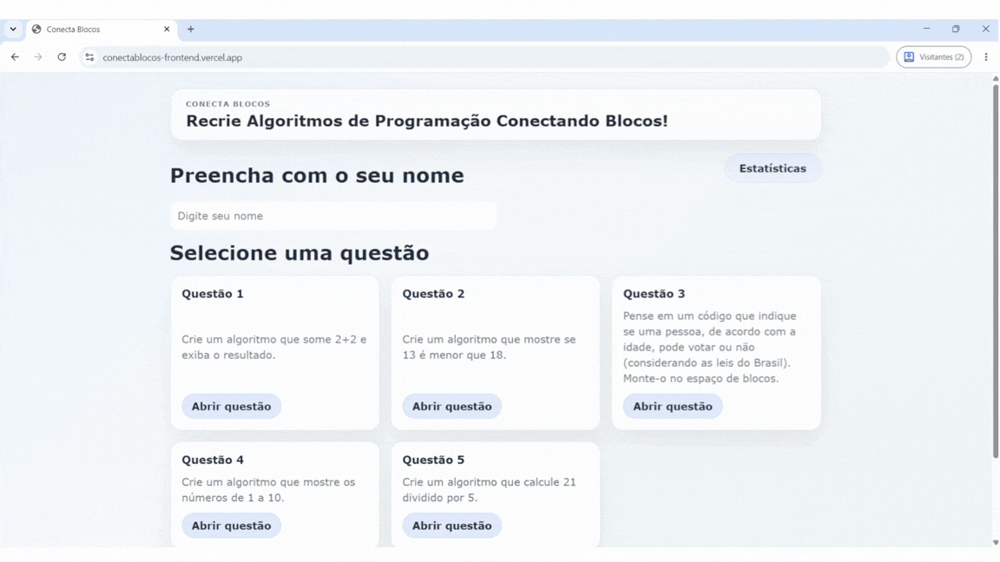

# Projeto: Aplicação com persistência de dados em backend




## Acesso
Acesso ao app: conectablocos-frontend.vercel.app

Como o deploy do backend está no Render, é possível que haja algum atraso na resposta se ele estiver "adormecido". Para resolver isso, é só esperar ou acessá-lo em: [deploy backend](conecta-blocos-giborelli.onrender.com)

## Desenvolvedor(a)
**Giovana Borelli** - Ciência da Computação

## Proposta
Criar uma ferramenta educacional para crianças aprenderem lógica de programação. A aplicação web terá uma interface onde o aluno resolve desafios arrastando blocos visuais no estilo Scratch, utilizando a biblioteca Blockly no frontend para interface e validação das respostas. Para atender o requisito de comunicação com o servidor e persistência de dados, o frontend enviará dados sobre as tentativas e resoluções dos desafios, como por exemplo, apelido do jogador, exercício resolvido, número de tentativas. O backend persistirá essas estatísticas no banco de dados, e o frontend também consumirá essa API para exibir um painel de estatísticas das resoluções. 

> O Blockly é uma biblioteca de desenvolvimento de código aberto da Raspberry Pi Foundation, originalmente desenvolvida no Google. Ele cria uma interface de programação visual que utiliza blocos de arrastar e soltar.

## Parceria
**Lucas Xavier Pairé** - Ciência da Computação

## Feedback/Comentário da parceria

Analisando os códigos, as diferenças estão bem claras por causa dos paradigmas das linguagens e bibliotecas escolhidas.

No frontend, a principal diferença de código está na manipulação do DOM. No arquivo script.js da Giovana, o controle do Blockly é feito com javascript, buscando as divs no DOM e chamando as funções da biblioteca. Em comparação, o meu código não manipula o DOM diretamente, ele manipula uma cópia do DOM, onde o framework React controla o ciclo de vida e os estados dos componentes. Estado seria uma memória interna de um componente que guardam dados mutáveis, então não pude injetar as funções do Blockly diretamente como a Giovana fez.

No backend, existe uma grande diferença da estrutura e verbosidade. O código em python dela é mais centralizado no arquivo main.py, usando o framework FastAPI, ela configura o CORS, a injeção de dependência do banco e a rota, tudo isso em menos linhas de código. Já no meu backend em Java com Spring Boot foi necessário criar múltiplos arquivos e pacotes separados seguindo uma arquitetura em camadas (Entity, Repository, Service, DTO e Controller) e a tipagem forte da linguagem.

Para o banco de dados, o código dela utiliza o ORM SQLAlchemy, definindo as tabelas como classes no arquivo models.py e extraindo os dados da requisição através da validação do Pydantic no arquivo schemas.py. No meu código, o mapeamento ocorre através de anotações do JPA/Hibernate dentro das entidades Java.

## Desenvolvimento

### Processo

A proposta era criar questões sobre pensamento computacional e usar a programação em blocos para resolvê-los. Ao iniciair o projeto, desconhecia a biblioteca Blockly e foi por recomendação da professora Andrea e de sites na internet que decidimos usá-la. Algumas funções no arquivo [script.js](./frontend/script.js) conversam diretamente com a biblioteca Blockly para converte o código da programação em blocos no código em linguagem Python equivalente. Isso permite maior controle sobre o armazenamento dos dados.

Decidi usar telas separadas para a construção de cada questão a fim de evitar confusão ou elementos em demasia em uma mesma tela, buscando a simplicidade na interface e tornando-a mais amigável. Cada questão é estática, então está diretamente escrita no arquivo [script.js](./frontend/script.js). Os gabaritos das questões são adicionados pelo backend, como é possível ver pelo arquivo [exemplo](./backend/inserir_gabaritos.py). Ao executar esse arquivo, ele adiciona os gabaritos e relaciona-os com as questões e tentativas por meio da equivalência do id_questao.

A principal dificuldade ao começar o backend foi na construção do Banco de Dados (BD) e entender a conexão e necessidade de uma database, models e schemas separados. Durante o desenvolvimento da aplicação, mudou-se os parâmetros das tabelas enviadas, adaptando-se ao contexto exigido no momento. O restante do código de backend está relacionado com as verificações de código e o acompanhamento das rotas de requisições HTTP do tipo POST e GET, demarcado pelo decorador oficial do FastAPI: @app.post() e @app.get().

O deploy do backend no Render foi complicado e demorado, porque o BD não era reconhecido. Para encontrar onde estava o erro ou como corrigir ele, procurei nos sites recomendados pelo log da aplicação e tinha dois problemas principais: 
1. O pacote psycopg geralmente não é identificado como necessário se já está em uso o psycopg2, então o requirements.txt não incluiu ele, impedindo que o deploy acontecesse.
2. Ao criar as aplicações de BD e backend, foi recomendado usar a mesma região física para os acessos serem internos. Entretanto, o Render não conseguia identificar o BD internamente, portanto foi utilizado o URL externo.

Os demais deploys ocorreram tranquilamente ao seguir os passos dos sites oficiais.

### Trechos de código

Gostaria de destacar esse primeiro trecho de código, porque todas as aplicações que utilizam FastAPI e precisa permitir solicitações de outras fontes, precisam configurar o Middleware. 

```main.py
app = FastAPI()

app.add_middleware(
    CORSMiddleware,
    allow_origins=["*"],
    allow_credentials=True,
    allow_methods=["*"],
    allow_headers=["*"],
)
```

O segundo trecho de código foi separado para destacar a construção da estrutura do BD. Demonstra-se os schemas do banco, em que são definidos quais os atributos (tipos e tamanho) e requisitos mínimos para cada uma das tabelas criadas com o BaseModel.

```schemas.py
class TentativaCreate(BaseModel):
    nome: str = Field(min_length=1)
    id_questao: str = Field(min_length=1)
    n_tentativas: int = Field(ge=1)
    code: str = ""
    workspace_json: dict | None = None


class GabaritoCreate(BaseModel):
    id_questao: str = Field(min_length=1)
    code: str = Field(min_length=1)
    workspace_json: dict | None = None
```

O terceiro e último trecho está relacionado com a biblioteca Blockly, mais especificamente com a definição dos blocos que estarão disponíveis para a resolução do usuário. Abaixo só a primeira parte da variável toolbox.

```script.js
const toolbox = {
  kind: 'categoryToolbox',
  contents: [
    {
      kind: 'category',
      name: 'Números e Texto',
      contents: [
        { kind: 'block', type: 'math_number' },
        { kind: 'block', type: 'math_arithmetic' },
        { kind: 'block', type: 'text' },
        { kind: 'block', type: 'text_print' }
      ]
    }, 
    ...
  ]
}
```


## Tecnologias

### Linguagens e afins
- Back-end: Python (com FastAPI)
- Banco de Dados: PostgreSQL
- Linguagens Front-end: HTML, CSS, JavaScript e Blockly
- Deploy: Vercel + Render

### Ambiente de desenvolvimento
- VS Code
- Github Copilot Chat

## Referências e créditos

Substitua este trecho por uma lista bem detalhada de todo material 
- Blockly: (https://docs.blockly.com/guides/get-started/)
- FastAPI: https://fastapi.tiangolo.com/tutorial/
    * Conexão com Banco de Dados Relacional: https://www.youtube.com/watch?v=NvOV3ig2tGY
- PostgreSQL: https://medium.com/@coutinholps/usando-postgresql-com-fastapi-em-8-passos-2bd5b406de25
- Render:
    * Configurações: https://render.com/docs/deploy-fastapi
    * Application log (recomendados para corrigir erros): https://render.com/docs/troubleshooting-deploys (genérico) e https://docs.sqlalchemy.org/en/20/errors.html#error-e3q8 (erro específico)
- Vercel: https://vercel.com/docs/git/vercel-for-github


---
Projeto entregue para a disciplina de [Desenvolvimento de Software para a Web](http://github.com/andreainfufsm/elc1090-2026b) em 2026b